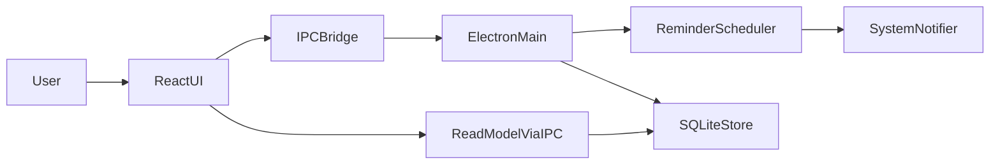

# Build Custom Desktop Reminder App

## Goal
Create a desktop reminder application using Electron + React with:
- One-time reminders
- Recurring reminders (daily/weekly/monthly)
- System notifications only (no email in v1)

## Architecture
- **UI layer (React):** reminder list, create/edit form, upcoming reminders view.
- **Desktop shell (Electron main process):** scheduler loop, notification dispatch, app lifecycle.
- **Data layer (local storage):** SQLite database for reminders and recurrence metadata.

## Implementation Plan
1. **Project scaffolding**
   - Initialize Electron + React app (Electron Forge/Vite setup).
   - Configure secure IPC (`contextBridge`) and app packaging baseline.

2. **Data model and persistence**
   - Define `reminders` schema: id, title, notes, dueAt, timezone, type(one-time/recurring), recurrenceRule, enabled, createdAt, updatedAt.
   - Add SQLite access layer with CRUD operations and query for due reminders.

3. **Reminder scheduler engine**
   - Implement background scheduler in Electron main process.
   - Poll every fixed interval (e.g., 30s) and compute next fire time per reminder.
   - For recurring reminders, compute and persist next occurrence after firing.

4. **Notification integration**
   - Use Electron/OS system notification API.
   - Handle app-start catch-up logic for reminders missed while app was closed.

5. **UI workflows**
   - Build views for create/edit/delete reminders and toggling enabled status.
   - Add recurrence controls (none/daily/weekly/monthly).
   - Show next trigger time and status in reminder list.

6. **Validation and reliability**
   - Validate date/time inputs and recurrence rules.
   - Add guardrails for duplicate firing and timezone edge cases.

7. **Testing and packaging**
   - Add unit tests for recurrence calculation and due-reminder selection.
   - Smoke test notifications on Windows.
   - Produce first distributable desktop build.

## v1 Constraints
- Local-only data (no account sync).
- System notifications only.
- Single-user desktop context.

## Acceptance Criteria
- User can create one-time and recurring reminders.
- Reminder fires as an OS notification at expected time.
- Recurring reminders continue generating the next occurrence correctly.
- Reminder data persists across app restarts.